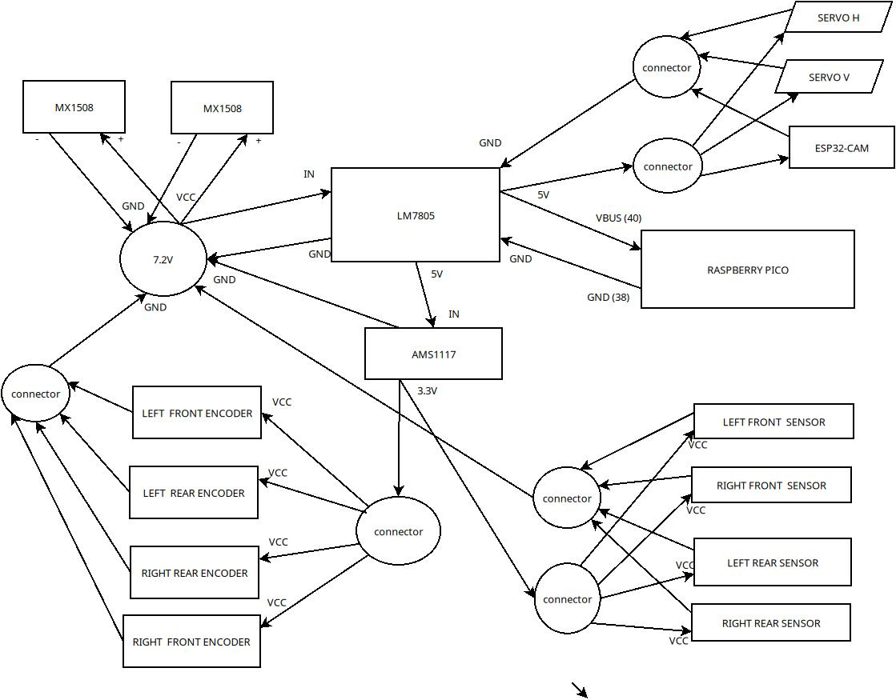
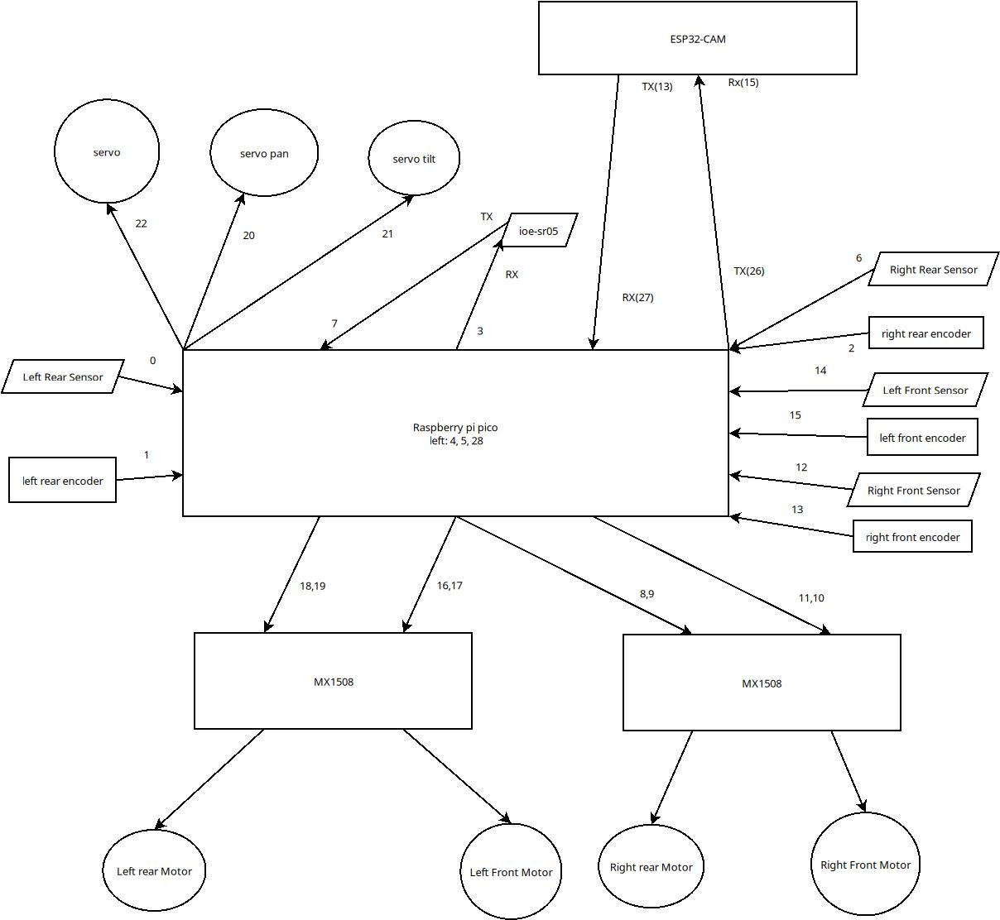

# Surveillance robots

## esp32-cam

This is a robot using ESP32-CAM without encoders (so it could be controled only by a human).

It has the original application for web streaming from expressif.

---

## 4wd

---

### 4wd_pico_esp32

This is a robot using ES32-CAM and Raspberry Pico.

ESP32-CAM is used for WIFI communication and camera streaming.

Raspberry PICO is used to command servo, navigation and engines.

It has:

- pantilt camera (ESP32-CAM)
- 4 encoders for engines
- 2 IR collision sensors in front
- 2 IR collision sensors in back

### Power lines

### Logical connections

